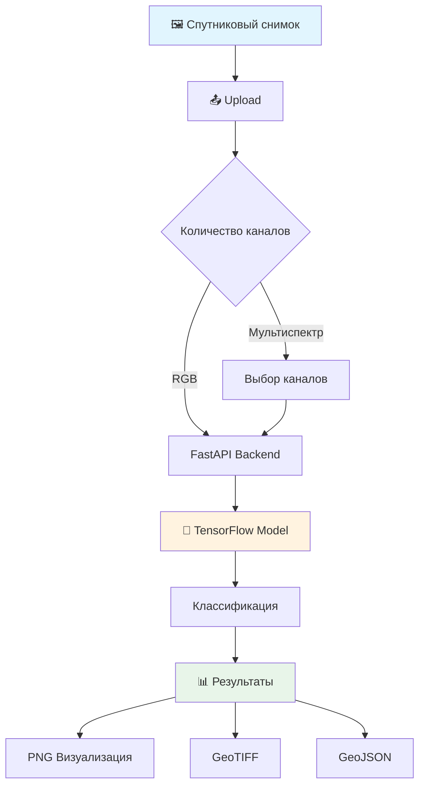

# 🛰️ EuroSAT Satellite Image Classifier

<div align="center">


<h3>🌍 Веб-приложение для автоматической классификации спутниковых снимков с использованием методов глубокого обучения</h3>

[🚀 Демо](https://eurosatapp.streamlit.app/) • [API Docs](#-api) • [Установка](#-установка) • [Использование](#-использование)

</div>

---

## 🚀 Попробуйте прямо сейчас!

**Приложение было развернуто на занятии и доступно онлайн.** Вы можете протестировать классификацию спутниковых снимков прямо в браузере без установки:

<div align="center">
  
### [🌐 Открыть EuroSAT Classifier](https://eurosatapp.streamlit.app/)

</div>

Просто загрузите спутниковый снимок и получите результат классификации за несколько секунд. 

Приложение поддерживает:
- 📸 RGB изображения (JPG, PNG)
- 🛰️ Мультиспектральные снимки (GeoTIFF)
- 📥 Экспорт результатов в различных форматах

> **⚠️ Важно:** Серверная часть развернута на сервисе Render.com с бесплатным тарифным планом. При первом обращении возможен холодный старт (до 120 секунд). Обработка больших растров может завершиться ошибкой из-за ограничений ресурсов. Для работы с большими изображениями рекомендуется развернуть приложение локально или на более мощном сервере.

---

## ✨ Возможности

<table>
<tr>
<td width="50%">

### 🚀 Основные функции

- **10 классов земного покрова** с точностью 94%
- **Возможность работы с мультиспектральными снимками**
- **Веб-интерфейс** на Streamlit
- **REST API** для интеграции
- **Обработка по батчам** для скорости и эффективного использования ресурсов
- **Экспорт результатов** в разных форматах

</td>
<td width="50%">

### 🎨 Классы земного покрова

| Класс | Цвет | Название |
|-------|------|----------|
| 🌾 Посевы |  | AnnualCrop |
| 🌲 Лес |  | Forest |
| 🌿 Травы |  | HerbaceousVegetation |
| 🛣️ Дороги |  | Highway |
| 🏭 Промзоны |  | Industrial |
| 🐄 Пастбища |  | Pasture |
| 🍇 Многолетние |  | PermanentCrop |
| 🏘️ Жилые |  | Residential |
| 🏞️ Реки |  | River |
| 🌊 Водоёмы |  | SeaLake |

</td>
</tr>
</table>

## 🏗️ Архитектура



## 💻 Установка

### 📋 Требования

- Python 3.8+
- 4GB RAM минимум

### 🔧 Локальная установка

#### 1️⃣ Создайте виртуальное окружение

```bash
# Для conda (рекомендуется)
conda create -n eurosat python=3.9
conda activate eurosat

# Или используйте venv
python -m venv venv
source venv/bin/activate  # Linux/Mac
# venv\Scripts\activate  # Windows
```

#### 2️⃣ Установите Python пакеты

```bash
pip install -r requirements.txt
```

#### 3️⃣ Скачайте модель

```bash
mkdir models
# Скачайте модель и поместите в папку models/
```

## 🚀 Запуск

### 🎯 Быстрый старт

```bash
# Запуск backend
uvicorn main:app --reload --host 0.0.0.0 --port 8000

# В новом терминале - запуск frontend
streamlit run app.py
```

Откройте браузер:
- 🎨 **Frontend**: http://localhost:8501
- 📚 **API Docs**: http://localhost:8000/docs

### ☁️ Деплой на Render.com

1. Создайте аккаунт на [Render.com](https://render.com)
2. Создайте новый Web Service
3. Подключите GitHub репозиторий
4. Настройте:
   - **Environment**: Python 3
   - **Build Command**: `pip install -r requirements.txt`
   - **Start Command**: `uvicorn main:app --host 0.0.0.0 --port $PORT`
5. Добавьте environment variables если нужно
6. Deploy!

## 📖 Использование

### 🌐 Через веб-интерфейс

1. **Загрузите изображение**
   - Поддерживаются: GeoTIFF, TIFF, JPG, PNG
   - Максимальный размер: 200MB

2. **Для мультиспектральных снимков**
   - Выберите каналы для RGB композита
   - Используйте пресеты (например, 4-3-2 для Landsat)

3. **Классифицируйте**
   - Нажмите кнопку "Классифицировать"
   - Дождитесь результатов (2-10 сек)

4. **Скачайте результаты**
   - PNG визуализация
   - GeoTIFF с картой классификации
   - GeoJSON с векторными полигонами

### 🔌 API

#### Проверка состояния
```bash
curl http://localhost:8000/health
```

#### Проверка количества каналов
```python
import requests

with open("image.tif", "rb") as f:
    response = requests.post(
        "http://localhost:8000/check_channels/",
        files={"file": f}
    )
    print(response.json())  # {"channels": 4}
```

#### Классификация
```python
# Простая классификация
with open("image.tif", "rb") as f:
    response = requests.post(
        "http://localhost:8000/classify_all/",
        files={"file": f},
        params={"channels": "4,3,2"}  # Опционально
    )
    results = response.json()

# Сохранение результатов
import base64

# PNG визуализация
with open("result.png", "wb") as f:
    f.write(base64.b64decode(results["visualization"]))

# GeoTIFF
with open("result.tif", "wb") as f:
    f.write(base64.b64decode(results["geotiff"]))

# GeoJSON
with open("result.geojson", "w") as f:
    f.write(results["geojson"])
```


## 🛠️ Конфигурация

### Параметры модели

```python
# В classifier.py
patch_size = 64      # Размер патча для классификации
batch_size = 64      # Размер батча для предсказаний
```

### Оптимизация производительности

```python
# Увеличьте batch_size для GPU
classifier = EuroSATClassifier(
    MODEL_PATH, 
    patch_size=64, 
    batch_size=128  # Для GPU
)
```

## 📁 Структура проекта

```
📂 eurosat-classifier/
├── 📄 app.py                 # Streamlit интерфейс
├── 📄 main.py                # FastAPI сервер
├── 📄 classifier.py          # Логика классификации
├── 📄 requirements.txt       # Зависимости
├── 📁 models/               
│   └── 🧠 best_eurosat_model.h5
```


## 🔐 API Endpoints

| Endpoint | Method | Описание |
|----------|--------|----------|
| `/health` | GET | Проверка состояния сервиса |
| `/classes` | GET | Список классов и цветов |
| `/check_channels/` | POST | Проверка количества каналов |
| `/get_preview/` | POST | Создание RGB превью |
| `/classify_all/` | POST | Полная классификация |
| `/docs` | GET | Swagger документация |

## 🐛 Решение проблем

### ❌ Недостаточно памяти

- Уменьшите размер изображения
- Используйте обработку по частям

### ❌ Модель не найдена

Убедитесь, что файл `best_eurosat_model.h5` находится в папке `models/`

